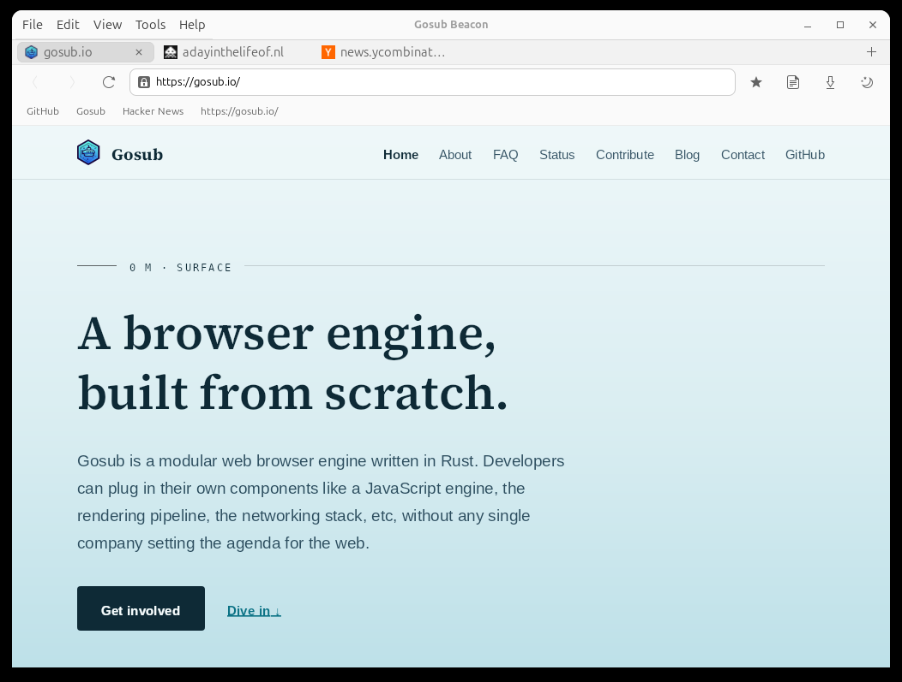

# Gosub browser engine

Gosub is a browser engine written from scratch in Rust. It has its own HTML5 and CSS3
parsers, an async networking stack, a zone/tab model that isolates cookies and storage
per zone, and a choice of render backends (Cairo, Skia, Vello/wgpu). The engine is meant
to be embedded: you provide the UI and a render surface, the engine handles the rest.

Don't expect a daily driver yet. There is no JavaScript and no form input, but it does
render real pages. Below is Beacon, our GTK4 browser built on the engine:

## Repositories

The active repositories:

| Repository | What it is |
| --- | --- |
| [gosub-engine](https://github.com/gosub-io/gosub-engine) | The browser engine itself. Start here |
| [gosub-beacon](https://github.com/gosub-io/gosub-beacon) | Beacon, a GTK4 browser built on the engine |
| [gosub-sonar](https://github.com/gosub-io/gosub-sonar) | Async HTTP networking stack |
| [gosub-baleen](https://github.com/gosub-io/gosub-baleen) | Experimental adblock / request filter engine |
| [gosub.io](https://github.com/gosub-io/gosub.io) | The gosub.io website |
| [tests.gosub.io](https://github.com/gosub-io/tests.gosub.io) | Test pages for browser testing |
| [web-weekly](https://github.com/gosub-io/web-weekly) | Weekly renders of popular sites to track engine progress |
| [css-typegen](https://github.com/gosub-io/css-typegen) | Generates Rust types for CSS properties |

The other repositories are proofs of concept and archived experiments.

## How to get involved

We love contributions from everybody. Read the [contribution page](https://gosub.io/contribute/)
to find out more, or come ask around in the chat.

## Links

| Link | Description |
| --- | --- |
| https://gosub.io | Main website |
| https://chat.developer.gosub.io | Zulip developer chat |
| https://chat.gosub.io | General user chat (Discord) |
| https://wiki.developer.gosub.io | Project wiki |
